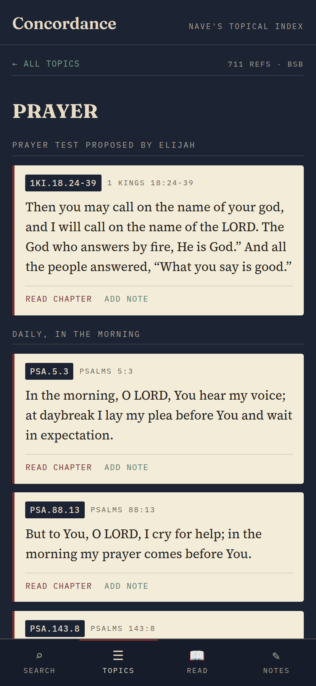
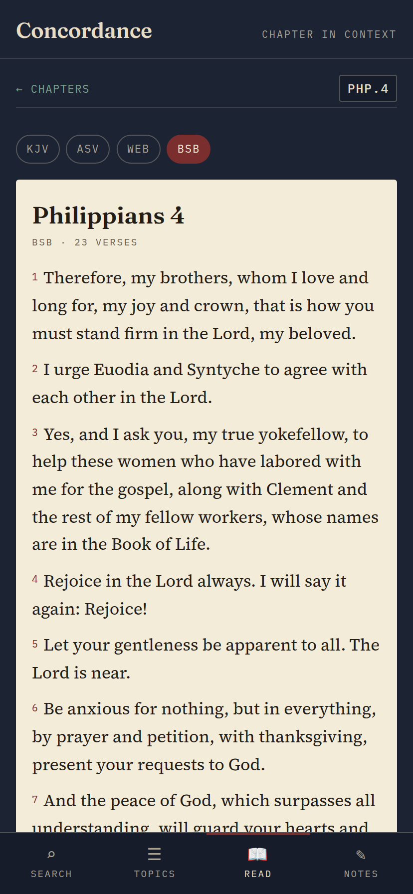

# Concordance

A Bible study app for one person, running on hardware you own. Four public domain
translations, Nave's Topical Bible, full text search across both, and somewhere to
keep your notes. All of it lives in a single SQLite file.

No accounts. No API keys. No calls out to anybody's server once it's installed. It
starts up, opens a file on disk, and answers questions about it.

| Search | Topics | Read |
| :----: | :----: | :--: |
|  |  |  |

## Getting it running

```sh
make setup
make serve
```

`make setup` builds a virtualenv, pulls down about 26 MB of scripture, grinds it
into `data/concordance.db`, and compiles the interface. Budget three minutes, most
of it download time. Then `make serve` starts one process on `127.0.0.1:8000` that
hands out both the API and the UI.

That database file is the entire application state, so backing it up backs up your
notes. Don't just `cp` it while the app is running: WAL mode means recent writes
live in `concordance.db-wal` until a checkpoint, and a copy taken mid-flight can
miss them. Either stop the service first, or let SQLite do it live:

```sh
sqlite3 data/concordance.db ".backup '/mnt/backups/concordance.db'"
```

`make data` rebuilds scripture from the sources and carries any notes across.
Nothing brings them back if you lose the file itself.

## What's in it

**Search** runs over 124,372 verses through SQLite's FTS5, filtered by translation
with the chips at the top. Matched words come back marked in the verse text. Results
arrive best-match-first by default; the small link in the Verses header flips them
into Genesis-to-Revelation order, which is what you want when you're tracing a word
through the canon rather than hunting one line.

**Topics** searches the same box against 4,667 Nave's topic names. Type "pray" and
PRAYER comes back with its 711 references, grouped under the sub-headings Nave's
wrote for them: "Daily, in the morning," "Prayer test proposed by Elijah," and so
on down the list.

**Reading** gives you the chapter with its verses numbered, prev and next running
across book boundaries, and a dot beside any verse you've written on.

**Notes** attach to a verse and live in the same database as everything else, which
means they surface in search results next to scripture. Search "prison" and you'll
get Acts 16 alongside the thing you wrote about Philippians last March.

**Cross-refs** work through Nave's rather than a cross-reference dataset, since v1
has no such dataset and Strong's is out of scope. Two verses are related when Nave's
files them under the same topic, smallest topics first, so PHP.4.6 pulls up CARE and
THANKFULNESS before it pulls up GOD.

## How it's built

FastAPI on Python's stdlib `sqlite3`. React 18 and Vite on the front, no UI
framework, fonts bundled into the build so nothing phones Google. One SQLite file
in WAL mode.

Everything hangs off FTS5, which python.org builds, Debian, Ubuntu, Fedora, Alpine
and Homebrew all enable, but a hand-rolled SQLite compiled without
`SQLITE_ENABLE_FTS5` does not. The ETL checks on the way in and stops with an
explanation rather than a confusing SQL error. To check first:

```sh
python3 -c "import sqlite3; sqlite3.connect(':memory:').execute('CREATE VIRTUAL TABLE t USING fts5(x)')"
```

The shape of it:

```text
etl/         the one-time data pipeline
  fetch_sources.py   download the public domain sources
  build_db.py        parse them into data/concordance.db
  schema.sql         the schema, commented
  books.py           66 books, their codes, and name resolution
server/      the API: main.py, search.py, refs.py, db.py
web/         the SPA: views.jsx, components.jsx, sheets.jsx, styles.css
tests/       38 tests over the parsing rules and every endpoint
```

Development is `make dev`, which puts the API on 8000 and Vite with hot reload on
5173, proxying `/api` across.

## Where the text comes from

| Source | Gives us | License |
| --- | --- | --- |
| [scrollmapper/bible_databases][sm] | KJV, ASV, BSB | public domain texts |
| [seven1m/open-bibles][ob] | WEB | public domain |
| [BradyStephenson/bible-data][bd] | Nave's | dataset CC BY 4.0, Nave's itself public domain |

[sm]: https://github.com/scrollmapper/bible_databases
[ob]: https://github.com/seven1m/open-bibles
[bd]: https://github.com/BradyStephenson/bible-data

Two wrinkles worth knowing about.

bolls.life was unreachable from the machine this got built on, so the translations
come from GitHub-hosted datasets instead. Same public domain texts, different host.

WEB comes from a different source than the other three because scrollmapper doesn't
carry it. It arrives as USFX XML, so `build_db.py` walks the tree and throws out the
footnote and cross-reference apparatus before anything reaches the index. Genesis 1:1
in WEB carries a footnote about אֱלֹהִ֑ים; you'd rather not find that by searching
for "Hebrew."

Every download is pinned to a commit and checked against a SHA-256 digest before
it lands in `data/sources`, so a rebuild years from now produces the same database
and a source that changes underneath you fails loudly instead of quietly rewriting
scripture.

The ETL also drops references that don't resolve to a real verse. Nave's entries mix
prose and citations on one line, and the parser occasionally reads a number out of
the prose. Checking each reference against the verse table catches those, 62 of them
across 76,141.

## The database

```sql
verses(id, book, chapter, verse, translation, text)
topics(id, name, section)
topic_verses(topic_id, verse_ref, book, chapter, verse_start, verse_end, heading, seq)
notes(id, verse_ref, book, chapter, verse, translation, body, created_at, updated_at)
books(code, name, ordinal, testament)
translations(code, name, year, license, source)
```

`book` holds a three-letter USFM code, so any row can name itself: `PHP.4.6`. Ranges
keep their shape (`PHP.4.6-7`) and a whole-chapter citation drops the last segment
(`NUM.17`). `topic_verses` carries the string for display and the split columns for
joining, so nothing has to parse a reference at query time.

Three FTS5 indexes. `verses_fts` and `notes_fts` use the porter stemmer, so "loved"
finds "love." `topics_fts` deliberately doesn't, and that took a bug to learn:
porter rewrites your query prefix the same way it rewrote the index, so "pray" stems
to "prai," prefix-matches PRAISE, and never reaches PRAYER. Topic names now index
raw, with a substring fallback behind them.

Verses never change after the ETL runs, so their index gets built in one shot and
left alone. Notes change constantly, so triggers keep `notes_fts` honest.

## The API

| Endpoint | Returns |
| --- | --- |
| `GET /api/meta` | translations, books, chapter counts |
| `GET /api/search?q=&translation=&sort=` | verses, matching topic names, and your notes |
| `GET /api/topics?q=` | topic names with reference counts |
| `GET /api/topics/{id}` | one topic, grouped under Nave's sub-headings |
| `GET /api/chapter/{book}/{chapter}` | a chapter, its neighbours, per-verse note counts |
| `GET /api/verse/{ref}` | one verse in one translation or all four |
| `GET /api/cross-refs/{ref}` | related verses by way of shared topics |
| `GET POST PATCH DELETE /api/notes` | your notes |
| `GET /api/health` | liveness, cheap enough to poll |
| `GET /api/stats` | verse, topic and note counts |

Interactive docs sit at `/api/docs`.

Search results carry `text` clean and `segments` as `[{text, hit}]`, so the UI can
mark the matches without anyone interpolating HTML into a verse. Whatever you type
gets quoted into literal FTS terms before it goes near the query parser, which means
a stray `-` or the word `AND` searches for itself instead of throwing a syntax error.
Quoted phrases survive as phrases.

## The look

Ink indigo `#1C2333` underneath, parchment `#E8DCC4` on top of it, oxblood `#7A2E2E`
for the primary accent, verdigris `#5C7A6B` for the secondary, paper `#F2ECD9` for
cards. Fraunces sets headings, Source Serif 4 carries scripture, IBM Plex Mono does
every reference, label, and piece of chrome.

The reference stamp is the whole visual idea: a dark badge with light monospace type,
the way a call number sits on a spine. It looks the same on a result card, in a
sheet, in the reader header, and on the pager buttons, and once you've read a few
screens you stop reading the words around it and just look for the stamp. Cards are
paper with an oxblood spine down the left. Verdigris marks the secondary track:
topics, notes, cross-references.

Built mobile first, four tabs along the bottom, and the tab strip stays under the
text column on a wide screen instead of drifting to the corners.

> The static HTML mockup mentioned in the brief never made it into the session, so
> all of the above comes from the written spec. Send the file and matching the rest
> is one pass through `web/src/styles.css`.

## On the homelab

`make serve` listens on loopback. To reach it from your phone, bind every interface:

```sh
make serve HOST=0.0.0.0
```

There's no auth, by design, which makes the tailnet the security boundary. Bind wide
only on a machine where that boundary holds, and keep it off anything public.

```ini
# /etc/systemd/system/concordance.service
[Unit]
Description=Concordance
After=network.target

[Service]
WorkingDirectory=/srv/concordance
ExecStart=/srv/concordance/.venv/bin/uvicorn server.main:app --host 0.0.0.0 --port 8000
Restart=on-failure
User=you

[Install]
WantedBy=multi-user.target
```

## Tests

```sh
make test
```

38 of them. Half cover the parsing rules that are cheap to break and expensive to
notice: book codes, the Nave's citation grammar (an implied book carrying across
`1CH 6:3; 23:13`, whole-chapter refs, numbers in prose that aren't references),
call numbers, and FTS query building against hostile input. The other
half drive every endpoint against a scratch copy of the real database.

## What it doesn't do

No commentaries, no Strong's or original languages, no cloud sync, no second user,
no reading plans. Song of Solomon has no entries in this Nave's dataset, so it turns
up in search and reading but under no topic. Cross-references come from topical
co-occurrence and will sometimes hand you something sideways.
