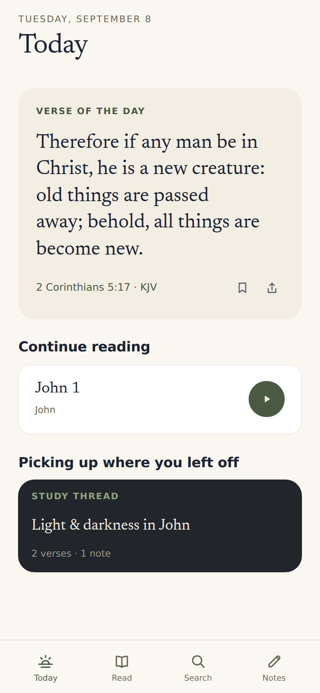
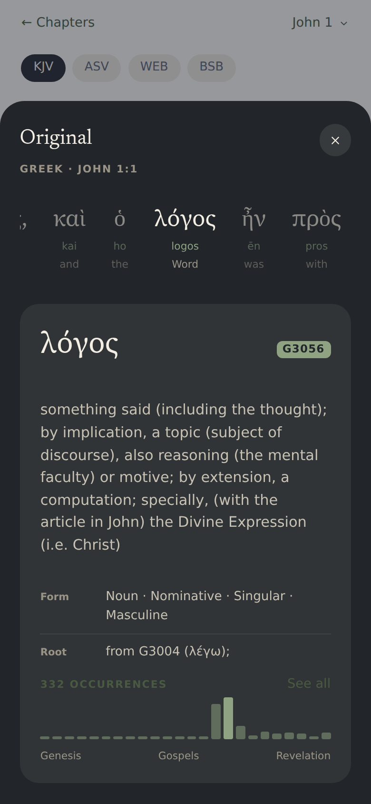
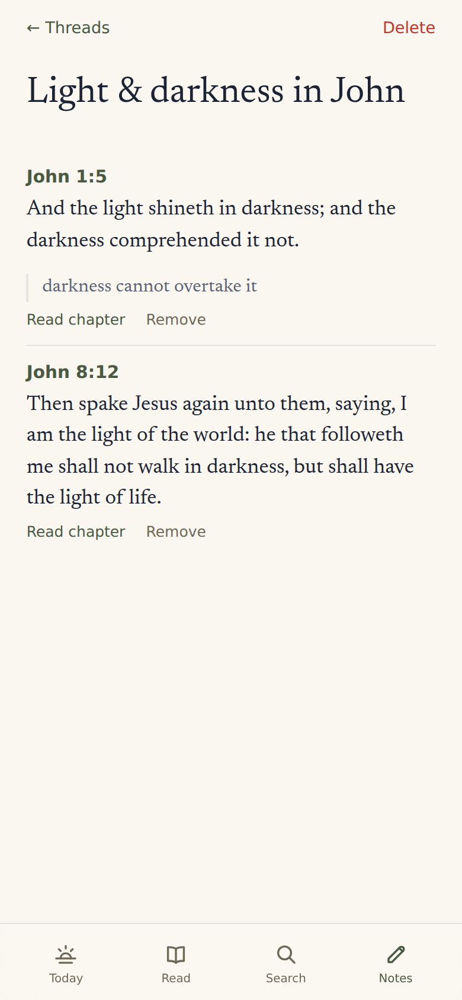
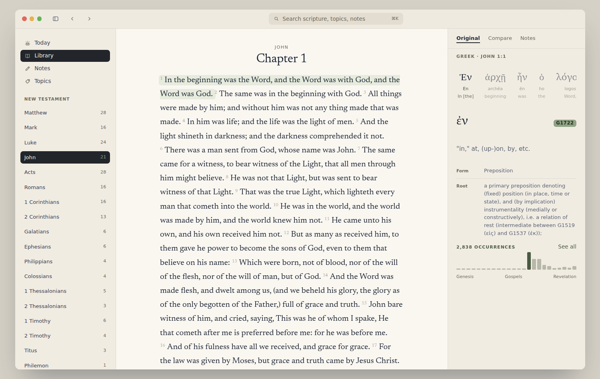

# Concordance

A Bible study app for one person, running on hardware you own. Four public domain
translations, Nave's Topical Bible, full text search across both, and somewhere to
keep your notes. All of it lives in a single SQLite file.

No accounts. No API keys. No calls out to anybody's server once it's installed. It
starts up, opens a file on disk, and answers questions about it.

| Today | Search | Read |
| :---: | :----: | :--: |
|  |  |  |

| Original | Topics | Threads |
| :------: | :----: | :-----: |
|  |  |  |

On a screen wide enough for it, the phone's tabs and sheets become a three-column study desk:



## Getting it running

```sh
make setup
make serve
```

`make setup` builds a virtualenv, pulls down about 130 MB of scripture and tagged
originals, grinds it into `data/concordance.db`, and compiles the interface. Budget
five minutes, most of it download time. Then `make serve` starts one process on `127.0.0.1:8000` that
hands out both the API and the UI.

That database file is the entire application state, so backing it up backs up your
notes. Don't just `cp` it while the app is running: WAL mode means recent writes
live in `concordance.db-wal` until a checkpoint, and a copy taken mid-flight can
miss them. Either stop the service first, or let SQLite do it live:

```sh
sqlite3 data/concordance.db ".backup '/mnt/backups/concordance.db'"
```

`make data` rebuilds scripture from the sources and carries any notes across.
Nothing brings them back if you lose the file itself.

## What's in it

**Today** is the first screen: one verse, picked deterministically from the date so
it's the same all day and needs no network to compute; where you left off reading,
one tap from resuming; and whichever study thread or topic you were most recently
in. No feed, no badge counts.

**Search** defaults to meaning: type a phrase and an on-device LSA index (TF-IDF
reduced with truncated SVD, built once by the ETL) surfaces verses that say the same
thing without sharing your words, tagged "Related" beside the plain FTS5 "Exact"
hits — "faith without works is dead" reaches James 2:17 ("if it hath not works, is
dead"), which an exact-word search never could. Exact and Strong's sit one tap away
as filters: Strong's mode reads the box as a Hebrew or Greek word rather than
English text, so "logos" (no accent needed) finds G3056 before its look-alikes. It
all still runs over the same 124,372 verses, filtered by translation with the chips
underneath. Type a reference instead of a word — "John 3:16", "1 Thess 4:16",
"Psalm 23", or the app's own `PHP.4.6` — and the verse itself comes back as a card
above the text hits, one tap from its chapter.

**Topics** searches the same box against 4,667 Nave's topic names, one tap behind
Search rather than its own tab: type "pray" and PRAYER comes back with its 711
references, grouped under the sub-headings Nave's wrote for them — "Daily, in the
morning," "Prayer test proposed by Elijah," and so on down the list.

**Reading** gives you the chapter with its verses numbered, prev and next running
across book boundaries, and a dot beside any verse you've written on. Select a
verse (or click it, on the Mac) and Highlight, Note, Original and Share surface
right there, rather than living in permanent chrome around the text.

**Notes and highlights** attach to a verse and live in the same database as
everything else, which means notes surface in search results next to scripture.
Search "prison" and you'll get Acts 16 alongside the thing you wrote about
Philippians last March. A highlight is the lighter mark — no text, just remembered.

**Study threads** are the one new primitive: a named collection of verses, each
with an optional short annotation, that you build while reading rather than a flat
note dropped and forgotten. "Light & darkness in John" holds John 1:5, John 8:12
and 1 John 1:5 with a line on each of what it's doing there. Add a verse to a
thread from its note editor (or the Mac's right rail); the thread itself lives
under Notes, and the one you touched most recently follows you onto Today.

**Cross-refs** work through Nave's rather than a cross-reference dataset, since there
is no such dataset here. Two verses are related when Nave's files them under the same
topic, smallest topics first, so PHP.4.6 pulls up CARE and THANKFULNESS before it
pulls up GOD.

**The original languages** sit one tap behind every verse, on a dark sheet, one word
at a time: a strip of the whole verse's words to tap through, and beneath it the
selected word's Hebrew, Aramaic or Greek as it is written, a transliteration, the
sense it carries *here*, its Strong's number and its parsing, and a small chart of
where else it turns up across the canon. Tap through to Strong's own entry, and
under that, every other verse the word stands in — 318 verses for λόγος, each showing
what the taggers made of it in that place, which is how you find out that the word
behind "communication" in Matthew 5:37 is the same one behind "the Word" in John 1:1.

The words are set beside the English, not aligned to it. No public dataset lines up
these four translations word for word, so the app puts the whole verse next to its
original and lets you do the joining. Anything else would be a guess wearing a
confident face.

## How it's built

FastAPI on Python's stdlib `sqlite3`, plus numpy at request time for meaning
search's cosine ranking. React 18 and Vite on the front, no UI framework, fonts
bundled into the build so nothing phones Google. One SQLite file in WAL mode.

Meaning search's model (TF-IDF reduced with truncated SVD) is fit once by the ETL
with scikit-learn — a build-time-only dependency in `etl/requirements.txt` that
never has to be installed where the app actually runs, since the server
re-implements the query-time transform by hand in `server/embeddings.py`.

Everything hangs off FTS5, which python.org builds, Debian, Ubuntu, Fedora, Alpine
and Homebrew all enable, but a hand-rolled SQLite compiled without
`SQLITE_ENABLE_FTS5` does not. The ETL checks on the way in and stops with an
explanation rather than a confusing SQL error. To check first:

```sh
python3 -c "import sqlite3; sqlite3.connect(':memory:').execute('CREATE VIRTUAL TABLE t USING fts5(x)')"
```

The shape of it:

```text
etl/         the one-time data pipeline
  fetch_sources.py   download the public domain sources
  build_db.py        parse them into data/concordance.db
  schema.sql         the schema, commented
  books.py           66 books, their codes, and name resolution
  originals.py       the tagged Hebrew/Aramaic/Greek and Strong's, parsed
  embeddings.py      fits the meaning-search model (scikit-learn, build-time only)
server/      the API: main.py, search.py, refs.py, originals.py, embeddings.py, db.py
web/         the SPA: App.jsx, desktop.jsx, views.jsx, components.jsx, sheets.jsx, styles.css
tests/       tests over the parsing rules and every endpoint
```

Development is `make dev`, which puts the API on 8000 and Vite with hot reload on
5173, proxying `/api` across.

## Where the text comes from

| Source | Gives us | License |
| --- | --- | --- |
| [scrollmapper/bible_databases][sm] | KJV, ASV, BSB | public domain texts |
| [seven1m/open-bibles][ob] | WEB | public domain |
| [BradyStephenson/bible-data][bd] | Nave's | dataset CC BY 4.0, Nave's itself public domain |
| [STEPBible/STEPBible-Data][sb] | the tagged Hebrew, Aramaic and Greek, and the morphology codes in English | CC BY 4.0 |
| [openscriptures/strongs][os] | Strong's dictionary entries | Strong's is public domain; the JSON is CC BY-SA |

[sm]: https://github.com/scrollmapper/bible_databases
[ob]: https://github.com/seven1m/open-bibles
[bd]: https://github.com/BradyStephenson/bible-data
[sb]: https://github.com/STEPBible/STEPBible-Data
[os]: https://github.com/openscriptures/strongs

Two wrinkles worth knowing about.

bolls.life was unreachable from the machine this got built on, so the translations
come from GitHub-hosted datasets instead. Same public domain texts, different host.

WEB comes from a different source than the other three because scrollmapper doesn't
carry it. It arrives as USFX XML, so `build_db.py` walks the tree and throws out the
footnote and cross-reference apparatus before anything reaches the index. Genesis 1:1
in WEB carries a footnote about אֱלֹהִ֑ים; you'd rather not find that by searching
for "Hebrew."

Every download is pinned to a commit and checked against a SHA-256 digest before
it lands in `data/sources`, so a rebuild years from now produces the same database
and a source that changes underneath you fails loudly instead of quietly rewriting
scripture.

The ETL also drops references that don't resolve to a real verse. Nave's entries mix
prose and citations on one line, and the parser occasionally reads a number out of
the prose. Checking each reference against the verse table catches those, 62 of them
across 76,141.

## The database

```sql
verses(id, book, chapter, verse, translation, text)
topics(id, name, section)
topic_verses(topic_id, verse_ref, book, chapter, verse_start, verse_end, heading, seq)
original_words(id, book, chapter, verse, seq, lang, surface, translit, gloss,
               strongs, strongs_base, morph, parsing, lemma, lemma_gloss,
               editions, variant)
strongs_entries(id, lang, lemma, translit, pron, derivation, definition, kjv_usage)
notes(id, verse_ref, book, chapter, verse, translation, body, created_at, updated_at)
books(code, name, ordinal, testament)
translations(code, name, year, license, source)
```

`book` holds a three-letter USFM code, so any row can name itself: `PHP.4.6`. Ranges
keep their shape (`PHP.4.6-7`) and a whole-chapter citation drops the last segment
(`NUM.17`). `topic_verses` carries the string for display and the split columns for
joining, so nothing has to parse a reference at query time.

Three FTS5 indexes. `verses_fts` and `notes_fts` use the porter stemmer, so "loved"
finds "love." `topics_fts` deliberately doesn't, and that took a bug to learn:
porter rewrites your query prefix the same way it rewrote the index, so "pray" stems
to "prai," prefix-matches PRAISE, and never reaches PRAYER. Topic names now index
raw, with a substring fallback behind them.

Verses never change after the ETL runs, so their index gets built in one shot and
left alone. Notes change constantly, so triggers keep `notes_fts` honest.

`original_words` holds 447,513 rows — 300,825 Hebrew, 4,827 Aramaic, 141,861 Greek —
and needs no full-text index at all: a Strong's number is an exact key, so the
concordance is an index scan rather than a search. `strongs_base` is the number
without the letter STEPBible adds to disambiguate one Strong's number covering two
words, which is what joins a word to its dictionary entry.

Verse 0 is a Psalm superscription. Hebrew counts the title as verse 1 and English
Bibles print it unnumbered, so it has no verse of its own to hang off; the API sets
it at the head of verse 1, which is where it is read.

## The API

| Endpoint | Returns |
| --- | --- |
| `GET /api/meta` | translations, books, chapter counts |
| `GET /api/today` | a deterministic verse of the day, and the most recently touched thread |
| `GET /api/search?q=&translation=&sort=&mode=` | verses (tagged exact/meaning), matching topic names, your notes, Strong's matches — and the verse itself when `q` is a reference |
| `GET /api/topics?q=` | topic names with reference counts |
| `GET /api/topics/{id}` | one topic, grouped under Nave's sub-headings |
| `GET /api/chapter/{book}/{chapter}` | a chapter, its neighbours, per-verse note/highlight/thread flags |
| `GET /api/verse/{ref}` | one verse in one translation or all four |
| `GET /api/cross-refs/{ref}` | related verses by way of shared topics |
| `GET /api/interlinear/{ref}` | one verse word by word in Hebrew, Aramaic or Greek |
| `GET /api/strongs/{number}` | a Strong's entry, how the taggers read it, and its occurrence histogram |
| `GET /api/strongs/{number}/verses` | every verse the word stands in |
| `GET POST PATCH DELETE /api/notes` | your notes |
| `GET POST DELETE /api/highlights` | verses marked with no note attached |
| `GET POST /api/threads`, `PATCH DELETE /api/threads/{id}` | study threads |
| `POST /api/threads/{id}/items`, `PATCH DELETE /api/threads/items/{id}` | a thread's verses |
| `GET /api/health` | liveness, cheap enough to poll |
| `GET /api/stats` | verse, topic, note and thread counts |

Interactive docs sit at `/api/docs`.

Search results carry `text` clean and `segments` as `[{text, hit}]`, so the UI can
mark the matches without anyone interpolating HTML into a verse. Whatever you type
gets quoted into literal FTS terms before it goes near the query parser, which means
a stray `-` or the word `AND` searches for itself instead of throwing a syntax error.
Quoted phrases survive as phrases.

## The look

"If Apple made a Bible app": parchment `#FAF7F1` underneath, near-navy ink `#1C2434`
on it, sage `#4A5A42` for the accent, white cards, and dark chrome -- the tab bar, the
Original sheet, a study thread's card -- used deliberately inside the light theme
rather than as a separate mode. The system's own dark mode reuses that same
near-black-and-sage vocabulary for the whole shell. Newsreader sets headings and
scripture (Source Serif 4 stands behind it for the Greek subset it doesn't carry);
the system sans (SF Pro on a Mac, its equivalent elsewhere) does the chrome. No
monospace: references read as plain type, not a call-number stamp.

Scripture is the only thing at full contrast. Verse numbers, chrome and labels all
sit a step back, and depth -- the original languages, cross-references, a thread's
notes -- waits behind a tap instead of crowding the page. Reading a verse's original
is one motion: select the text (or, on the Mac, click it) and Highlight, Note,
Original and Share surface right there.

Built mobile first, four tabs along the bottom (Today, Read, Search, Notes -- Topics
lives one tap behind Search rather than owning a tab of its own), and the tab strip
stays under the text column on a wide screen instead of drifting to the corners. On
a screen wide enough for it, the phone's sheets become a three-column study desk
instead: a sidebar for navigation, book list and threads; a centred reading column
at a fixed measure; and a right rail that keeps Original, Compare and Notes open for
whichever verse you last clicked.

## On the homelab

`make serve` listens on loopback. To reach it from your phone, bind every interface:

```sh
make serve HOST=0.0.0.0
```

There's no auth, by design, which makes the tailnet the security boundary. Bind wide
only on a machine where that boundary holds, and keep it off anything public.

```ini
# /etc/systemd/system/concordance.service
[Unit]
Description=Concordance
After=network.target

[Service]
WorkingDirectory=/srv/concordance
ExecStart=/srv/concordance/.venv/bin/uvicorn server.main:app --host 0.0.0.0 --port 8000
Restart=on-failure
User=you

[Install]
WantedBy=multi-user.target
```

## Tests

```sh
make test
```

80 of them. About a quarter cover the parsing rules that are cheap to break and
expensive to notice: book codes, the Nave's citation grammar (an implied book
carrying across `1CH 6:3; 23:13`, whole-chapter refs, numbers in prose that aren't
references), call numbers, FTS query building against hostile input, and the
tagged-original grammar (which morpheme of a Hebrew word carries the dictionary
entry, Strong's numbers written four different ways, references with a second
versification in brackets). The rest drive every endpoint — including meaning
search, Strong's-mode lookup, study threads and highlights — against a scratch copy
of the real database, Genesis 1:1 and John 1:1 included, because a silently empty
interlinear would otherwise look exactly like a verse with no tagging.

## What it doesn't do

No commentaries, no cloud sync, no second user, no reading plans. Song of Solomon has
no entries in this Nave's dataset, so it turns up in search and reading but under no
topic. Cross-references come from topical co-occurrence and will sometimes hand you
something sideways.

**Highlighting an English word does not find its Greek.** The original is shown a
verse at a time, beside the English rather than mapped onto it. Word-level alignment
needs a dataset that ties a particular English word to a particular Greek one, and
none of these four translations ships with tags. The nearest exact source is a
Strong's-tagged KJV, which would work for the KJV alone and carries the Textus
Receptus with it.
